***Rachel Reuters - Engenharia de Machine Learning [25E1_3]***

Link pra o git:  [posGraduacaoIA/EngenhariaML/pdblackmamba at main · rachelreuters/posGraduacaoIA](https://github.com/rachelreuters/posGraduacaoIA/tree/main/EngenhariaML/pdblackmamba)

- [Introdução](#introdução)
- [Diagrama](#diagrama)
- [Estrutua dos arquivos](#estrutua-dos-arquivos)
- [Descrição dos artefatos](#descrição-dos-artefatos)
- [Respostas do Projeto de Disciplina e Rubricas explicadas :](#respostas-do-projeto-de-disciplina-e-rubricas-explicadas-)
  - [PD:](#pd)
  - [Rubricas:](#rubricas)
- [HOW TO:](#how-to)
  - [Requisitos:](#requisitos)
  - [Comandos:](#comandos)

# Introdução
Projeto de Engenharia de Machine Learning aplicado ao esporte, com foco no uso de modelos para prever resultados de partidas de basquete, mais especificamente para avaliar se o famoso Kobe Bryant converteu ou não a cesta. 
O projeto utiliza o framework **Kedro**, sendo estruturado em pipelines em que cada pipeline contem um grupo de nós.
A fim de gerenciar o ciclo de vida dos modelo, está sendo utilizado o **MlFlow**, facilitando a organização e rastreamento dos experimentos, o que é crucial para melhorar a reprodutibilidade e escalabilidade dos projetos de Machine Learning.
Pra realizar um teste de inferência e também exibir um dashboard com as análises do modelo, foi utilizado o **Streamlit**. 
O repositório organiza os dados de forma estruturada, incluindo artefatos como datasets de treino e teste, e resultados da avaliação do modelo em produção. A abordagem inclui análises estatísticas detalhadas e geração de relatórios sobre a performance do modelo, visando otimizar as previsões no contexto de um servidor de produção.

# Diagrama
Seguindo as nomenclaturas do Kedro (pipelines e nós): 
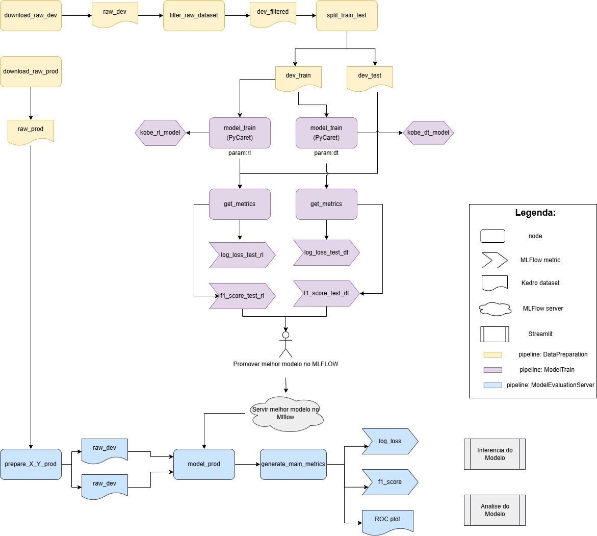

# Estrutua dos arquivos

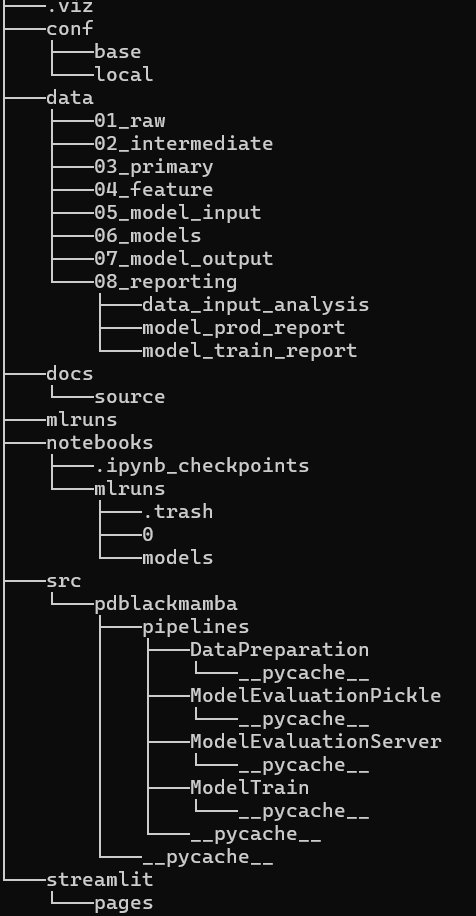

# Descrição dos artefatos
 - 01_raw
   - dataset_kobe_dev.parquet : Arquivo original para teste e treino do modelo 
   - dataset_kobe_prod.parquet : Arquivo original para avaliação do modelo em produção
 - 03_primary
   - data_filtered.parquet: Dataset de dev filtrado para treino e teste do modelo, nesse dataset foram removidos os nulos e selecionado as que irão ser utilizadas como teste e treino. Colunas : 'lat','lon','minutes_remaining','period','playoffs','shot_distance', 'shot_made_flag' 
 - 05_model_input
   - base_test.parquet : Dataset gerado depois de separar 80/20 o dataset de dev filtrado para testar o modelo.
   - base_train.parquet: Dataset gerado depois de separar 80/20 o dataset de dev filtrado para treinar o modelo.
   - x_prod.pkl : Arquivo pickle que representa o dado de producao ja filtrado e que sera utilizado como input do modelo para avaliacao em producao. 
   - y_prod.pkl: Arquivo pickle que representa o dado de producao ja filtrado e que sera utilizado para avaliar os resultados do modelo comparando com os outputs de predicao
 - 07_model_output
   - predict_prod_server.parquet: Resultado das metricas do modelo depois da avaliacao dos dados de producao comparando a predicao com os Y original. 
   - y_pred_prod.pkl: Resultado da predicao do modelo utilizando os dados de producao como entrada.
   - y_prob_prod.pkl: Resultado das probabilidades do modelo utilizando os dados de producao como entrada.
 - 08_reporting
   - data_input_analysis
     - dev_test_correlation.png: Correlacao dos dados de input do grupo de teste do dataset de dev. 
     - dev_test_distribution.png: Distribuicao dos dados de input do grupo de teste do dataset de dev. 
     - dev_test_lat_lon_shot_original.png: Plot da latitude e longitude com o shot_made_flag (Y) do grupo de teste do dataset de dev.
     - dev_train_correlation.png: Correlacao dos dados de input do grupo de treino do dataset de dev. 
     - dev_train_distribution.png: Distribuicao dos dados de input do grupo de treino do dataset de dev. 
     - dev_train_lat_lon_shot_original.png: Plot da latitude e longitude com o shot_made_flag (Y) do grupo de treino do dataset de dev.
     - dev_train_test_balance.png: Balanceamento do Y (shot_made_flag) comparando os dados de trein e teste do dataset de dev. 
   - model_prod_report
     - balance_Y_prod.png: Balanceamento do Y para o dataset de producao
     - lat_lon_shot_prod.png: Plot da latitude e longitude X modelo acertou ou errou
     - prod_metrics.png: Metricas do modelo com os dados de producao.
     - roc_curve_prod_server.png: ROC dos dados de producao aplicados no modelo da API
     - prod_data_distribution.png: Distribuicao dos dados de producao. 
   - model_train_report
     - dev_dt_lat_lon_shot_model_test.png : Plot da latitude e longitude X modelo acertou ou errou para o grupo de teste (modelo de arvore de decisao)
     - dev_lr_lat_lon_shot_model_test.png : Plot da latitude e longitude X modelo acertou ou errou para o grupo de teste (modelo de regressao logistica)
     - dev_model_feature_importance_dt.png : Importancia de features para o modelo de arvore de decisao 
     - dev_model_feature_importance_lr.png: Importancia de features para o modelo de regressao logistica
     - dev_roc_dt.png: Curva roc para o modelo de arvore de decisao no grupo de teste.
     - dev_roc_lr.png: Curva roc para o modelo de regressao logistica no grupo de teste.
     - dt_metrics.png: Metricas finais para o modelo de arvore de decisao.
     - lr_metrics.png: Metricas finais para o modelo de regressao logistica.
 - Metricas no MLFLOW:
   - PipelineAplicacao
     - f1_score: f1_score no modelo para o dataset de producao
     - log_loss: log_loss no modelo para o dataset de producao
     - precision_score: Precisao no modelo para o dataset de producao
     - recall_score: Recall no modelo para o dataset de producao
   - Treinamento
     - f1_score_dt_test: f1 score para a arvore de decisao para o grupo de teste
     - f1_score_lr_test: f1 score para a regressao logistica para o grupo de teste
     - log_loss_dt_test: log_loss para a arvore de decisao para o grupo de teste
     - log_loss_lr_test: log_loss para a regressao logistica para o grupo de teste
   - PreparacaoDados
     - test_size: tamanho do dataset de teste depois de dividir em treino e teste (80/20)
     - train_size: tamanho do dataset de treino depois de dividir em treino e teste (80/20)
 - Parametros no MLFLOW:
   - file_name_test_prefix
   - file_name_train_prefix
   - mlflow_experiment
   - model_dt
   - model_regLog
   - percent_test
 - Pipelines (Kedro):
   - DataPreparation: Essa etapa é responsável por preparar os dados para serem usados para treinar o modelo. Retirar nulos, separar dados de treino e teste, gerar métricas relativas aos dados iniciais. 
   - ModelEvaluation: Essa etapa é responsável por executar predição do modelo em dados de produção e com isso gerando métricas. 
   - ModelTrain:  Essa etapa é responsável por realizar treinos dos modelos, comparar modelos, gerar métricas, gerar plots dos relativos testes e treinos. 
 - Páginas do Streamlit:
   - main.py: Página inicial para redirecionar para as demais páginas.
   - Analise.py : Reune todos os resultados e análises dos modelos.
   - Inferencia.py: Input de dados de formulário para teste do modelo servido em produção pelo MLFlow.
  
# Respostas do Projeto de Disciplina e Rubricas explicadas :
## PD:
- Como as ferramentas Streamlit, MLFlow, PyCaret e Scikit-Learn auxiliam na construção dos pipelines descritos anteriormente? 
Streamlit oferece uma interface web  simples para visualizar resultados e parâmetros do modelo durante o desenvolvimento, alem disso permite que usuario teste o modelo de forma intuitiva. 
MLFlow é usado para rastrear experimentos, registrar modelos e gerenciar o versionamento, garantindo reprodutibilidade.
PyCaret automatiza etapas de machine learning, como pré-processamento e modelagem, permitindo construir e testar múltiplos modelos facilmente. 
Scikit-Learn fornece os algoritmos fundamentais para treinamento de modelos e preparacao de dados, alem disso ajuda na validação e avaliação de modelos.
-  Explique como a escolha de treino e teste afetam o resultado do modelo final. Quais estratégias ajudam a minimizar os efeitos de viés de dados.
A separacao dos dados de teste e treino e fundamental e afeta diretamente a capacidade do modelo de generalizar para novos dados. Se os dados de treino não representam bem o problema, o modelo pode aprender de maneira enviesada ou limitada. Se o conjunto de teste não é representativo, a avaliação do modelo será imprecisa.
Dados de treino muito grandes e teste muito pequenos podem levar a overfitting, pois o modelo será testado em um conjunto limitado de dados.
Por outro lado, treinar com poucos dados pode causar underfitting, já que o modelo não terá aprendido padrões suficientes. Um conjunto de treino ou teste mal balanceado (como uma classe com mais exemplos que outras) pode induzir viés nos resultados.
-Registre os parâmetros (% teste) e métricas (tamanho de cada base) no MlFlow
Estao registrados no item de pipeline *PreparacaoDados* do MLFLOW.
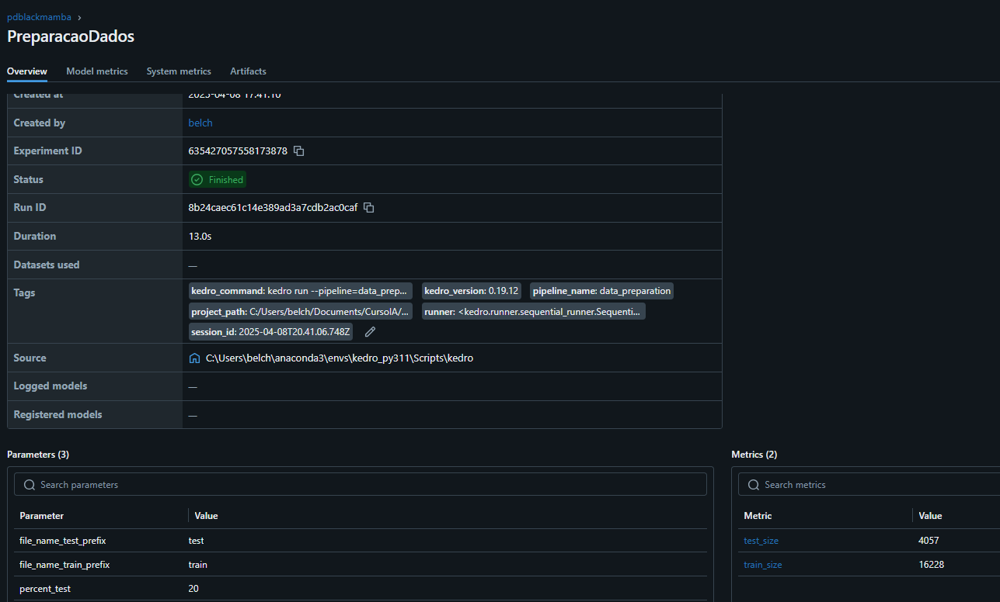
-  Implementar o pipeline de treinamento do modelo e escolha do melhor modelo
-Abaixo pode-se observar os resultados dos treinamentos dos modelos de arvore de decisao e regressao logistica. Ambos foram aplicados o tune_model do Pycaret.  
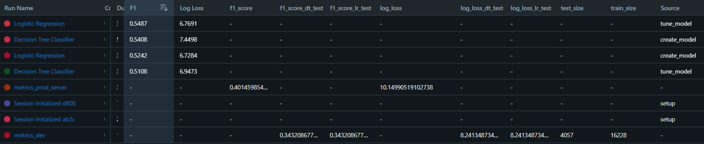
No item de pipeline do Mlflow "Treinamento" foram incluidas as metricas F1 e log_loss dos testes no modelo utilizando o dataset de teste. Pode-se observar que as metricas de ambos modelos foram muito proximas. O que diferenciou foi realmente as metricas no grupo de treino. Foi escolhido a **regressao logistica** pois obteve melhor performance de f1 score e log loss. Alem das metricas citadas, tambem foram observadas as curvas ROC (pode-se visualizar no Streamlit, na aba de analise), porem os modelos tiveram performances muito parecidas. 
Os modelos foram registrados no MLFLOW, e como a regressao logistica foi escolhida, esse modelo foi promovido para producao. 
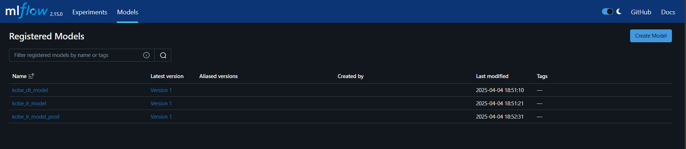
Apos essa escolha, esse modelo promovido foi utilizado para servir localmente atraves do MLflow atraves de API.
-Em seguida, para testar o modelo servido atraves da API, e possivel executar a pipeline *ModelEvaluationServer* (o comando pode ser encontrado no setor HOW TO mais abaixo). Essa pipeline utiliza os dados de producao (dataset_kobe_prod), filtra as colunas e remove os nulos (assim como foi realizado no grupo de dados de dev) para testar o modelo servido atraves de API pelo Mlflow. Os resultados obtivos das metricas foram salvos tanto num arquivo parquet (predict_prod_server.parquet) quanto registrados no MLFLOW, pelo item de pipeline do Mlflow *PipelineAplicacao*. 
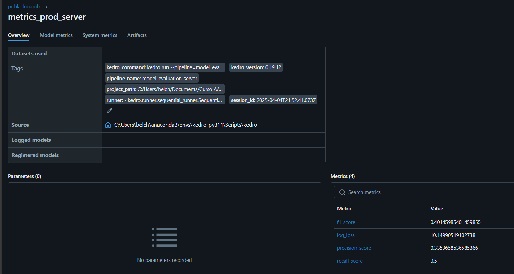
-  O modelo é aderente a essa nova base? O que mudou entre uma base e outra? Justifique.
Podemos ver que, em produção, a maioria dos arremessos tem uma distância entre 20 e 30, e esses valores quase não são observados no dataset de treino do modelo. Outra coisa é sobre a latitude, que teve maior grau de importância no treinamento do modelo. Enquanto que, nos dados de treino, os valores se concentraram entre 34 e 34.1, os de produção estão concentrados na faixa de 33.8, o que pode ter ocasionado a previsão de todos os dados como sendo 0 (errou a cesta). 
As imagens a seguir mostram os arremessos de dev e de prod, e podemos observar essa divergência citada acima. (essas análises podem ser vistas no Streamlit).
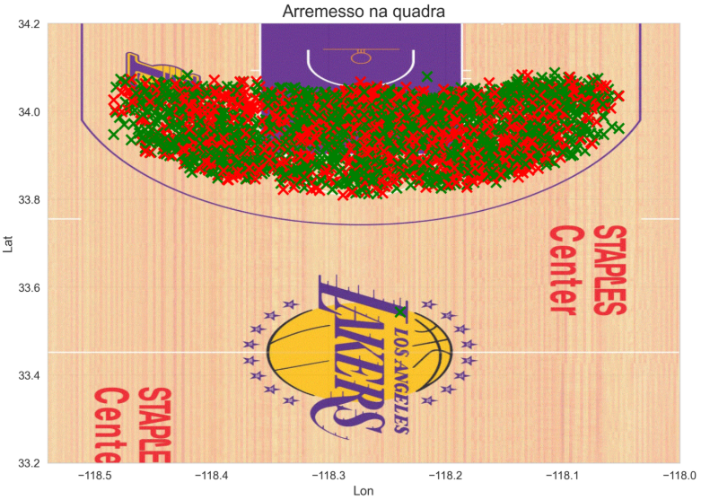
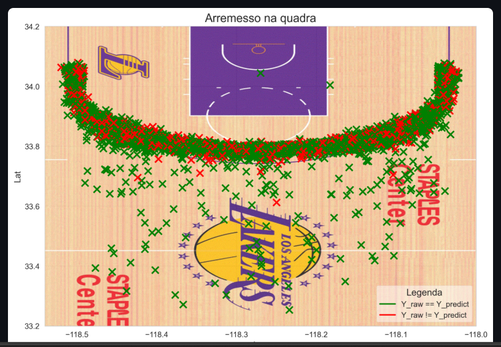 
-  Descreva como podemos monitorar a saúde do modelo no cenário com e sem a disponibilidade da variável resposta para o modelo em operação.
Com a disbonibilidade da variavel de resposta, pode utilizar as metricas mais comuns como F1, precisao, recall  (dependendo da figura de merito do problema em questao). Alem disso tem a curva ROC, e matriz de confusao que tambem devem apoiar no monitoramento. 
Sem a disponibilidade da variavel de resposta, o foco maior seria em observar  distribuicao dos dados, identificacao de outliers, e balanceamento das classes. 
Em ambos os casos e importante observar o padrao de comportamento dos resultados.   
-  Descreva as estratégias reativa e preditiva de retreinamento para o modelo em operação.
Na abordagem reativa, o modelo é retreinado após detectar problemas em desempenho. É uma estratégia baseada em eventos e depende de sinais específicos que indicam a necessidade de ajuste. Ocorre quando mudanças significativas nos dados são detectadas, como data drift ou concept drift. As vantagens de um modelo reativo é a simplicidade de implementacao e otimizacao de recursos (ja que treina o modelo apenas na necessidade), a principal desvantagem é o atraso entre a degradacao e sua correcao, podendo gerar problemas para os usuarios ou acidentes (dependendo do problema).
Na estrategia preditiva, o modelo e retreinado de forma programada com base nas analises preditivas que identificam quando o desempenho pode deteriorar (essas analises podem ser por exemplo padroes historicos de performance do modelo ). Vantagens desse metodo incluem períodos de baixa performance e a garantia de maior estabilidade no ambiente produtivo. Como desvantagem ocorre um maior custo computacional e tambem requer um sistema robusto de previsão para determinar intervalos de retreinamento eficientes.
- Streamlit 
  - Inferencia
Nessa tela o usuario pode realizar um teste utilizando o modelo em producao. 
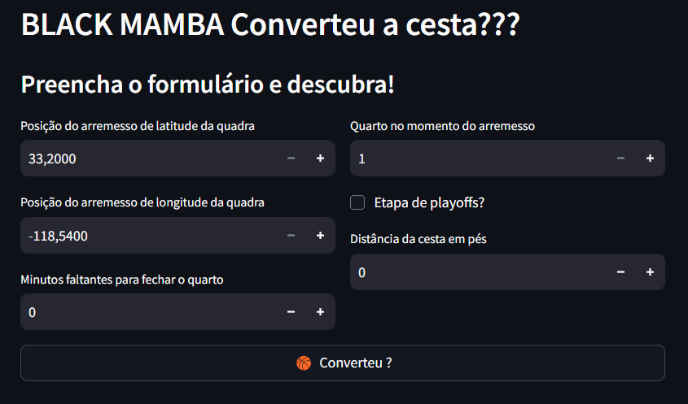 
O resultado da inferencia do modelo pode ser observado logo abaixo, apos o usuario clicar no botao de "Converteu?"
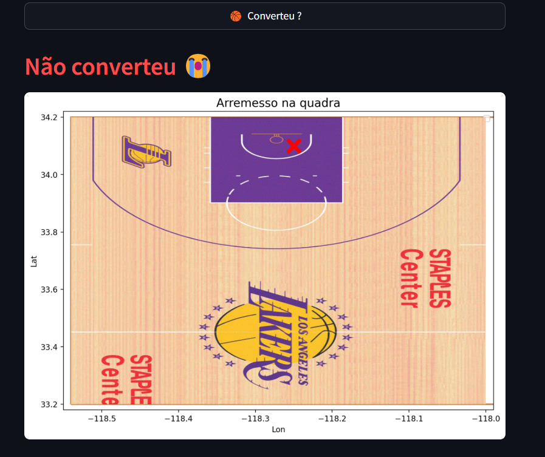
  - Analise 
Nessa tela pode ser visto varios graficos e analises dos dados, do treino do modelo, dos testes e as metricas. 
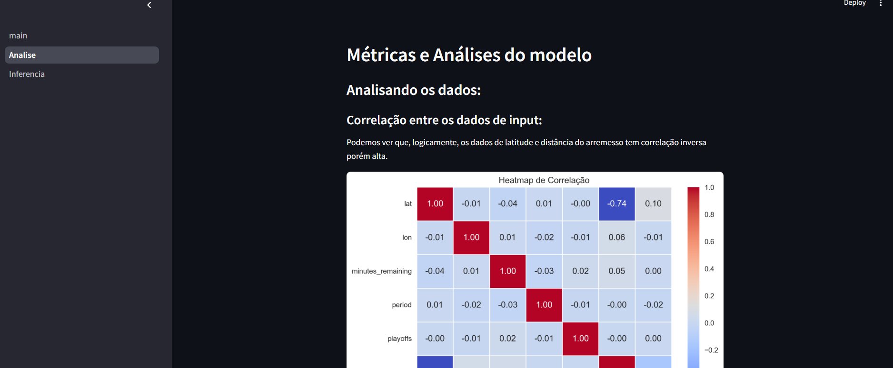

## Rubricas:
**1.1** O aluno categorizou corretamente os dados?

**R:** Tanto os dados de dev quanto de prod foram filtrados com as colunas (features) citadas no pd , além disso os dados nulos foram devidamente removidos (como pede no pd). Além disso, para treino e teste do modelo, foi separado em 80, 20 os grupos de treino e teste de forma estratificada. 

**1.2** O aluno integrou a leitura dos dados corretamente à sua solução?

**R:** Sim, o primeiro passo do pipeline de DataPreparation é realizar o download dos dados do github conforme link citado no PD.

**1.3** O aluno aplicou o modelo em produção (servindo como API ou como solução embarcada)?

**R:** Sim, atraves do MLFLOW com o comando 
     mlflow models serve ^
        -m models:/kobe_lr_model_prod/latest ^
        --env-manager=local ^
        --port 5001

**1.4** O aluno indicou se o modelo é aderente a nova base de dados?

**R:** O modelo é aderente, porém não é eficiente, já que principalmente com relação a latitude, que é a feature com maior grau de importancia para o modelo, teve padrão diferente do dataset de treino e de teste do modelo. O próximo passo para melhoria desse modelo em produção poderia ser retreinar novamente o modelo utilizando um conjunto de dados mais abrangente. 

**2.1** O aluno criou um repositório git com a estrutura de projeto baseado no Framework TDSP da Microsoft?

**R:** Utilizei o Kedro conforme instruido na aula.

**2.2** O aluno criou um diagrama que mostra todas as etapas necessárias para a criação de modelos?

**R:**  Sim, verificar Diagrama no inicio desse documento.

**2.3** O aluno treinou um modelo de regressão usando PyCaret e MLflow?

**R:** Sim, é possivel observar essa lógica no nó *model_train* no pipeline de nome *ModelTrain*. (o parametro para esse nó para treinar com árvore de decisão é o regLog)

**2.4** O aluno calculou o Log Loss para o modelo de regressão e registrou no mlflow?

**R:** Sim, é possivel observar essa lógica no nó *get_metrics* no pipeline de nome *ModelTrain*. 

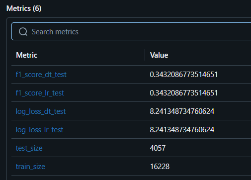

**2.5** O aluno treinou um modelo de árvore de decisao usando PyCaret e MLflow?

**R:** Sim, é possivel observar essa lógica no nó *model_train* no pipeline de nome *ModelTrain*. (o parametro para esse nó para treinar com árvore de decisão é o dt)

**2.6** O aluno calculou o Log Loss e F1 Score para o modelo de árvore de decisão e registrou no mlflow?

**R:** Sim, é possivel observar essa lógica no nó *get_metrics* no pipeline de nome *ModelTrain*. 

**3.1** O aluno indicou o objetivo e descreveu detalhadamente cada artefato criado no projeto?

**R:** No tópico Descrição dos artefatos presente nesse documento.

**3.2** O aluno cobriu todos os artefatos do diagrama proposto?

**R:** No tópico Descrição dos artefatos presente nesse documento.

**3.3** O aluno usou o MLFlow para registrar a rodada "Preparação de Dados" com as métricas e argumentos relevantes?

**R:** Salvei as metricas e parametros da preparação de dados e de treino do modelo na run do Mlflow com nome *PreparacaoDados*.

**3.4** O aluno removeu os dados faltantes da base?

**R:** Foram removidos os dados faltantes no nó *filter_raw_dataset*.

**3.5** O aluno selecionou as colunas indicadas para criar o modelo?

**R:** Foram selecionadas as colunas no nó *filter_raw_dataset*.

**3.6** O aluno indicou quais as dimensões para a base preprocessada?

**R:** As dimensoes da base de treino e teste (test_size e train_size) foram salvas como métrica no MLFLOW na run de nome *PreparacaoDados*. 

**3.7** O aluno criou arquivos para cada fase do processamento e os armazenou nas pastas indicadas?

**R:** Download inicial foi colocado na pasta 01_raw. Já os dados filtrados (remoção de nulos e seleção de colunas) está sendo salvo na pasta 03_primary. Após a separação de dados de treino e teste, esses arquivos estão sendo salvos no 05_model_input. 

**3.8** O aluno separou em duas bases, uma para treino e outra para teste?

**R:** Grupos de treino e teste estão sendo separados no nó *split_train_test* no pipeline de nome *DataPreparation*. Foi utilizada a técnica estratificada, garantindo que a proporção entre as classes do target seja preservada nos dois conjuntos.

**3.9** O aluno criou um pipeline chamado "Treinamento" no MlFlow?

**R:** Foram criados 3 pipelines de treinamento, um global que seria o resultado final dos treinamentos dos modelos e os parciais que correspondem ao treinamento do Pycaret. 

**4.1** O aluno identificou a diferença entre a base de desenvolvimento e produção?

**R:** Verificar resposta no tópico do PD. 

**4.2** O aluno descreveu como monitorar a saúde do modelo no cenário com e sem a disponibilidade da variável alvo?

**R:** Verificar resposta no tópico do PD.

**4.3** O aluno implementou um dashboard de monitoramento da operação usando Streamlit?

**R:**  Verificar resposta no tópico do PD. 

**4.4** O aluno descreveu as estratégias reativa e preditiva de retreinamento para o modelo em operação?

**R:**  Verificar resposta no tópico do PD. 

# HOW TO:
## Requisitos:
Versão do Python que foi criado o projeto: **Python 3.11**
Sistema operacional:  **Windows 11**
Gerenciador de pacotes do Python:  **conda** 

## Comandos:

Comandos para iniciar o ambiente virtual:

    conda create --name py11_kedro python=3.11    
    conda activate py11_kedro  

Instalar os pacotes:

    pip install -r requirements.txt

Para preparar os dados 

    kedro run --pipeline data_preparation

Para treinar o modelo:

    kedro run --pipeline model_train         

Apos o treinamento, verificar os plots e metricas resultantes dos treinamentos. Utilizando o mlflow :

    mlflow ui 

Com isso escolhe-se o melhor modelo (nesse caso a regressao logistica) , e serve ele utilizando o mlflow:

    mlflow models serve ^
        -m models:/kobe_lr_model_prod/latest ^
        --env-manager=local ^
        --port 5001

Para gerar as metricas encima dos dados de producao, acessando o modelo servido pelo Mlflow (escolhido anteriormente):

    kedro run --pipeline model_evaluation_server

Para acessar o formulário em streamlit para testar o modelo em produção  e verificar as inferências do modelo, entrar na pasta do streamlit e executar o comando:

    streamlit run main.py

